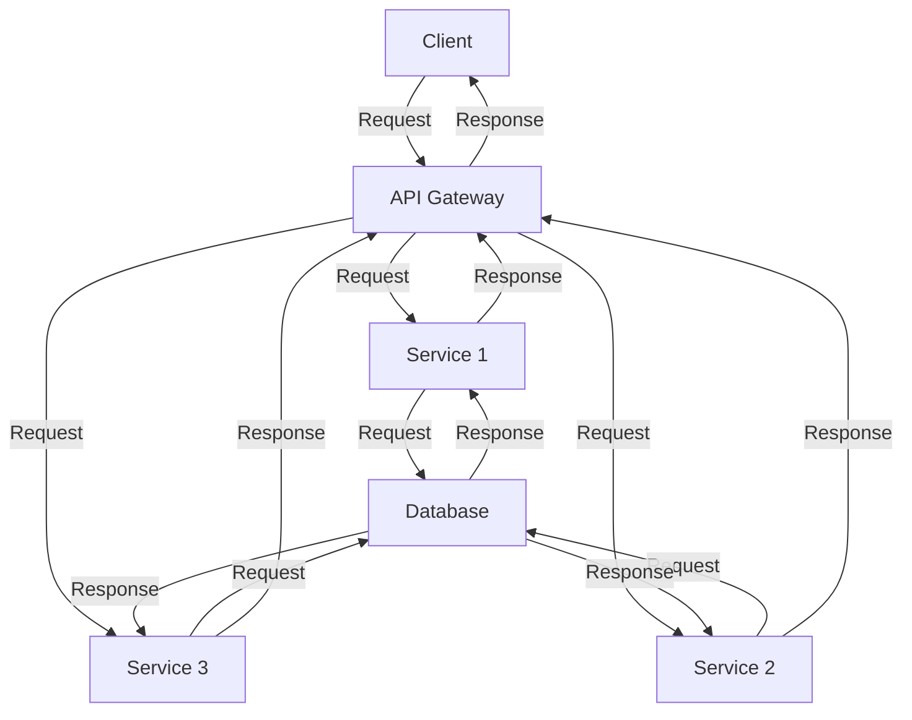

# jopoc

Just Testing again&#x20;

- Halo

## Create Mermaid markdown diagram for microservices

```mermaid
graph TD
  A[Client] -->|Request| B[API Gateway]
  B -->|Request| C[Service 1]
  B -->|Request| D[Service 2]
  B -->|Request| E[Service 3]
  C -->|Request| F[Database]
  D -->|Request| F
  E -->|Request| F
  F -->|Response| E
  F -->|Response| D
  F -->|Response| C
  E -->|Response| B
  D -->|Response| B
  C -->|Response| B
  B -->|Response| A
```

\`\`
